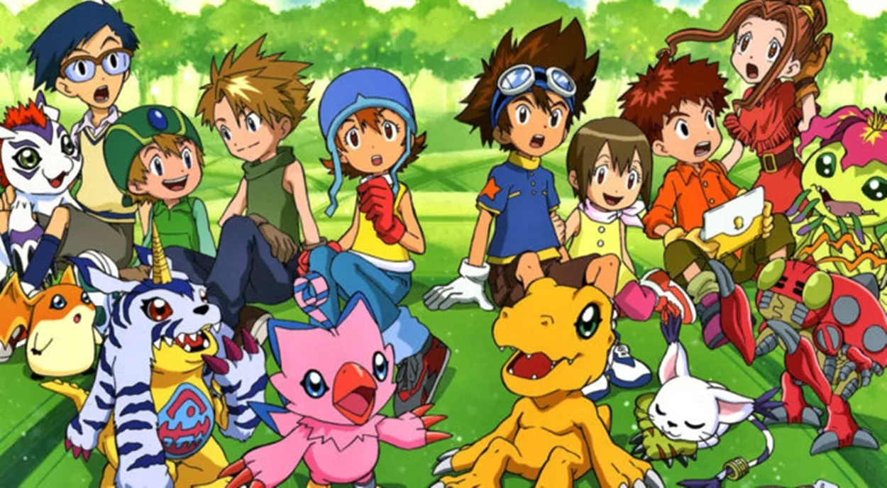

# Batalla Digimons

  

# Versión 1.0 del Juego

En la versión 1 del juego he creado la clase `BatallaDigital`:

- Implementar la clase `BatallaDigital` para la batalla entre Digimons.
- Selección aleatoria de un Digimon enemigo al inicio de la batalla.
- Añadir método `elige` para que el jugador seleccione su Digimon para la batalla.
- Incluir el método `pelea` que gestiona el combate, permitiendo elegir entre diferentes acciones (`Ataque1`, `Ataque2`, `Capturar`).
- Mostrar la salud de ambos Digimons después de cada acción.
- Condiciones para tener la derrota o victoria en la batalla.

## Clase Principal

- Implementar la clase `Principal` que es la interacción con el usuario.
- Solicitar al usuario ingresar el nombre del domador.
- Tener las opciones para iniciar una nueva batalla o salir del programa.
- Crear instancias de `BatallaDigital` para iniciar las batallas cuando se selecciona la opción correspondiente.
